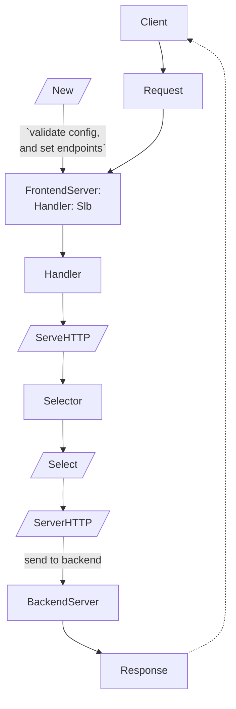

# Balance
A Simple and Effective Go Software Load Balancer

# Usage
Balance is built as a simple to use Load Balancer that disperses Requests to the server on which it runs as a proxy to the servers provided in its configuration.

Balance can be used as binary packed in a docker,

## Slb Package
Balance can be used directly from your code utilizing [`services/slb`](#Services/slb).
In this case you can incorporate the slb directly in your code, if you do not prefer running it as a separate service.

## Balance Service
The balance service itself runs a Grpc server to control and configure the load balancer (see api reference ./services/slb/api.proto)

#### Security
The balance service requires mTLS to access the SLBs API, to configure and use it.
In order to use the service, you must create the ca, key, and certificate on the machine or container running the service.

# Services/slb
The Slb can be used as a handler on instances of http.Server



# Builds 
## Docker
To build the Docker image run
```make balance-docker```
- Security: Add mTLS certificates to the container before running with its defaul entry point.